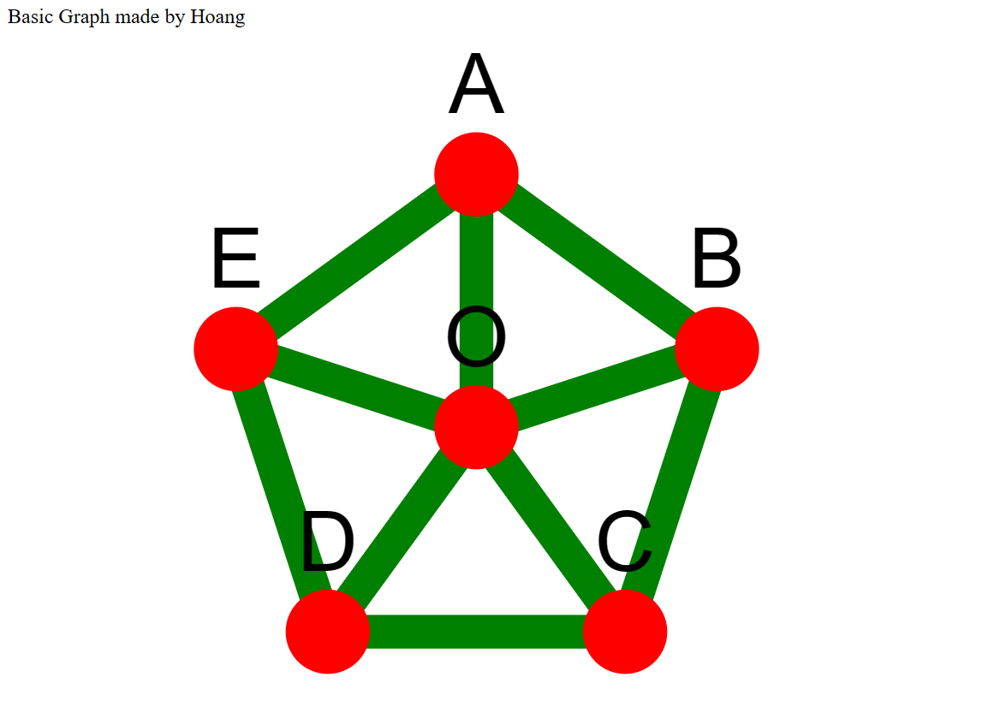

# Kết quả khi chạy chương trình

# Chú thích một số hàm khi sử dụng bộ thư viện chart Cytoscape.js
1. \. Dòng này nhúng thư viện Cytoscape.js vào tài liệu HTML. Ngoài ra 3.28.0 là version của thư viện đó.
2. var cy = cytoscape({ ... }). Dòng này khởi tạo một đối tượng Cytoscape mới với các cấu hình được xác định trong đối tượng JavaScript.
3. container: document.getElementById('cy'). Đây là cấu hình cho phần tử HTML sẽ chứa đồ thị. Trong đoạn code trên, đồ thị có id là ‘cy’ sẽ được hiển thị.
4. elements: [ ... ]. Đây là mảng chứa các nút và cạnh của đồ thị. Mỗi nút và cạnh được định nghĩa bởi một đối tượng có thuộc tính data.
5. style: [ ... ]. Đây là mảng chứa các quy tắc CSS để tùy chỉnh thuộc tính của các nút và cạnh. Ví dụ trong style của nút: width và height là chiều rộng và chiều cao, background-color là màu nút, font-size là kích cỡ chữ của nhãn (label) trên các nút, ...
6. layout: { ... }. Đây là cấu hình cho cách sắp xếp các nút và cạnh trên đồ thị. Trong đoạn code trên, layout 'concentric' nghĩa là các nút sẽ được sắp xếp thành các vòng tròn xung quanh một điểm trung tâm.
7. concentric: function(node){ return node.degree(); }. Đây là hàm xác định vị trí của mỗi nút trong layout 'concentric'. Trong trường hợp này, các nút có nhiều cạnh kết nối hơn sẽ được đặt gần trung tâm hơn. Hàm node.degree() trả về số lượng cạnh kết nối với nút đó.
8. minZoom và maxZoom: Khả năng zoom tối thiểu và tối đa của đồ thị.
